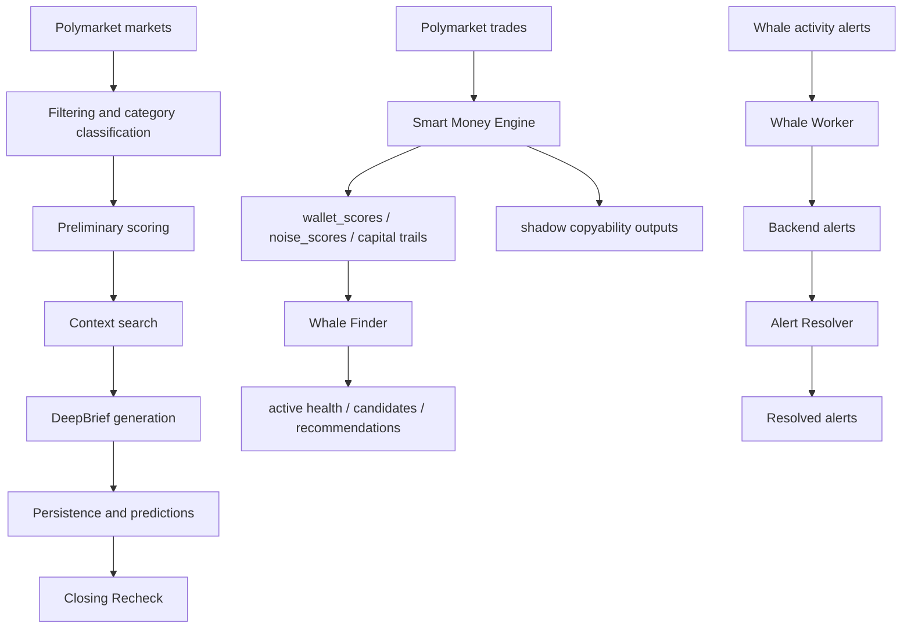

# RadarBallena / DeepEngine Workers

Repositorio Python que concentra los motores de analisis, generacion de DeepBriefs y workers de Smart Money de RadarBallena. Este checkout esta orientado a ejecucion por scripts, jobs y contenedores, no a la UI.

## 1. Que es este repositorio

Este repositorio agrupa tres capas principales:

1. Ingestion y filtrado de mercados de Polymarket.
2. DeepEngine / DeepSignal para scoring, contexto externo, DeepBriefs y Closing Recheck.
3. Workers de Smart Money para discovery, alertas, copyability y calidad de wallets.

La base del sistema es compatible con ejecucion local, scripts repetibles y despliegue por contenedor. El almacenamiento y la persistencia pueden depender de Supabase y de endpoints del backend cuando estan configurados.

## 2. Arquitectura general



DeepEngine trabaja sobre mercados. Smart Money trabaja sobre wallets, trades y alertas.

## 3. Estructura de carpetas

```txt
scripts/                  Orquestacion de pipeline, one-off runs y pruebas de soporte
services/                 Logica reusable: scoring, prompts, contexto, LLM, persistencia, Closing Recheck
schemas/                  Modelos Pydantic y schemas de salida
prompts/                  Prompts maestro, de reparacion y de Closing Recheck
workers/smart_money/      Workers de Smart Money
  whale_worker/           Alertas de whale trades hacia backend
  whale_finder/           Auditoria y discovery de wallets
  alert_resolver/         Resolucion de alerts y auditoria de marketId
  smart_money_engine/     Motor central de wallet skill, copyability y capital trail
deepengine_runtime/       Dockerfile separado para runtime de DeepEngine
requirements.txt          Dependencias principales del repo
outputs/                  Salidas locales generales, segun script o worker
output/                   Salidas de algunos scripts de DeepBrief / Closing Recheck
logs/                     Logs locales
```

## 4. Diferencia entre DeepEngine y Smart Money

### DeepEngine / DeepSignal

- Obtiene mercados activos de Polymarket.
- Filtra categorias no elegibles.
- Excluye deportes del MVP cuando el clasificador los detecta.
- Calcula preliminary score.
- Busca contexto externo.
- Genera DeepBriefs con LLM.
- Persiste resultados.
- Ejecuta Closing Recheck como flujo separado.

### Smart Money

- Observa trades y wallets.
- Calcula salud, skill, copyability y calidad.
- Genera alertas y recomendaciones de reemplazo.
- Mantiene flujos shadow o de auditoria para outputs intermedios.

No son el mismo motor ni comparten el mismo contrato de salida.

## 5. Flujo DeepEngine

1. `scripts/run_daily_pipeline.py` inicia el pipeline.
2. Se cargan mercados desde Polymarket.
3. Se guardan snapshots y se normaliza el payload.
4. `services/category_filter.py` clasifica eligibilidad por categoria.
5. `services/market_filter.py` excluye mercados cerrados, inactivos, poco utiles o novedad sin catalizador.
6. `services/scoring_service.py` calcula `preliminary_radar_score`.
7. Se selecciona un pool diversificado de candidatos.
8. `services/context_client.py` busca contexto externo si faltan fuentes.
9. `services/deepbrief_generator.py` construye prompt, llama al proveedor LLM y valida el DeepBrief.
10. Si el score AI queda anclado al preliminar, el pipeline intenta anti-anchoring y post-procesado.
11. `services/supabase_service.py` persiste DeepBrief y prediccion.
12. `services/deterministic_deepbrief_persistence.py` puede guardar fallback determinista si todos los LLM fallan y el flag esta activo.
13. `scripts/run_closing_rechecks.py` ejecuta el flujo separado de comparacion de cierre.

## 6. Flujo Smart Money

### 6.1 smart_money_engine

1. Lee trades recientes de Polymarket.
2. Normaliza y deduplica actividad.
3. Calcula wallet scores, noise scores y market capital trails.
4. Genera salidas shadow de copyability.
5. Construye cohortes y rankings adaptativos.
6. Calcula wallet skill, wallet quality y roster adaptativo.
7. Si esta habilitado, intenta upsert hacia Supabase.

### 6.2 whale_finder

1. Toma wallets activas y/o candidatas globales.
2. Calcula health score.
3. En modo discovery, audita wallets y propone reemplazos.
4. Puede correr una sola vez o como worker continuo.

### 6.3 whale_worker

1. Observa trades recientes de wallets configuradas.
2. Filtra ruido y trades irrelevantes.
3. Deduplica alertas ya vistas.
4. Limita alertas por mercado por corrida.
5. Publica alertas al backend cuando `DRY_RUN=false` y hay `INTERNAL_API_KEY`.

### 6.4 alert_resolver

1. Lee alerts unresolved desde backend.
2. Intenta completar `marketId` si falta.
3. Consulta el estado del mercado en Polymarket/Gamma.
4. Marca alertas como resueltas cuando el mercado ya tiene resultado utilizable.

## 7. Scripts principales

- `scripts/run_daily_pipeline.py`: pipeline principal de DeepEngine.
- `scripts/run_single_deepbrief.py`: genera un DeepBrief para un market existente.
- `scripts/run_closing_rechecks.py`: ejecuta Closing Recheck como job separado.
- `scripts/debug_run_closing_recheck_model.py`: runner manual/debug para comparar el flujo de cierre.
- `scripts/debug_render_closing_recheck_prompt.py`: renderiza el prompt de Closing Recheck.
- `scripts/generate_deepbrief.py`: wrapper legacy que delega al pipeline principal si se habilita explicitamente.
- `scripts/fetch_polymarket_markets.py`: fetch de mercados Polymarket.
- `scripts/fetch_markets.py`: variante de obtencion de mercados.
- `scripts/fetch_context.py`: obtencion de contexto.
- `scripts/compare_models_deepbrief.py`: comparador de modelos DeepBrief.
- `scripts/test_openai_service.py`: prueba de servicio OpenAI.
- `scripts/test_error_taxonomy.py`: prueba de clasificacion de errores.
- `scripts/test_supabase_connection.py`: prueba de conexion a Supabase.
- `scripts/test_supabase_writes.py`: prueba de escrituras a Supabase.

## 8. Services principales

- `services/polymarket_client.py`: obtencion y normalizacion de mercados activos.
- `services/category_filter.py`: clasificacion y exclusiones por categoria DeepEngine.
- `services/market_filter.py`: filtro de elegibilidad y relevancia.
- `services/scoring_service.py`: scoring preliminar, hybrid score y labels.
- `services/context_client.py`: busqueda de contexto externo.
- `services/context_ranker.py`: ranking de fuentes.
- `services/deepbrief_generator.py`: prompt, providers, validacion y fallback de DeepBrief.
- `services/deepbrief_schema.py`: schema Pydantic del DeepBrief.
- `services/deterministic_deepbrief_generator.py`: generacion determinista de fallback.
- `services/deterministic_deepbrief_persistence.py`: persistencia del fallback determinista.
- `services/closing_recheck_*`: builder, scoring, repository, client y servicio de Closing Recheck.
- `services/openai_service.py`: integracion auxiliar con OpenAI.
- `services/supabase_service.py`: persistencia y acceso a datos.
- `services/logger_service.py`: logging estandar.
- `services/error_types.py`: normalizacion de errores.

## 9. Schemas

- `schemas/deepbrief_schema.py`: define el formato estructurado del DeepBrief.
- `schemas/closing_recheck_schema.py`: define el resultado estructurado de Closing Recheck.
- `schemas/market_card_schema.json`: esquema auxiliar de tarjeta de mercado.

### DeepBrief schema

El schema confirma campos como:

- `lectura_clave`
- `radar_score`
- `radar_score_breakdown`
- `signal_label`
- `estela_de_capital`
- `entorno_de_senal`
- `corriente_narrativa`
- `filtro_de_ruido`
- `premortem`
- `mapa_de_ruptura`
- `mapa_de_escenarios`
- `actualizacion_bayesiana`
- `deepsignal_verdict`
- `confidence_level`
- `watch_triggers`
- `prediction_audit`

### Closing Recheck schema

El schema confirma campos como:

- `analysisMode`
- `marketId`
- `previousAnalysisId`
- `latestAnalysisId`
- `closingContext`
- `reevaluation`
- `metricBreakdown`
- `comparison`
- `recheckStatus`
- `importance`
- `recommendation`
- `thesis`
- `confidence`
- `riskFlags`
- `scoreParity`

## 10. Prompts

- `prompts/deepbrief_master_prompt.txt`: prompt maestro de DeepBrief.
- `prompts/closing_recheck_comparative_prompt.txt`: prompt comparativo de Closing Recheck.
- `prompts/shared_deepengine_criteria.txt`: criterios compartidos para el modo de cierre.
- `prompts/json_repair_prompt.txt`: instruccion de reparacion de JSON para retries.

## 11. Workers dentro de `workers/smart_money`

### 11.1 alert_resolver

Estado: funcional / legacy coexistente, con listener Telegram opcional y resolucion via backend.

Responsabilidad real:

- recibir o auditar alerts,
- resolver resultados de mercados,
- actualizar el backend con `resolved`, `result` e `isWin`.

No debe describirse como la fuente principal de alertas si Telegram queda deshabilitado o en rol legacy.

### 11.2 smart_money_engine

Estado: shadow / parcial / productivo segun flags y despliegue.

Responsabilidad real:

- calcular `wallet_scores.json`,
- `noise_scores.json`,
- `market_capital_trails.json`,
- `estela_capital_by_market.json`,
- shadow outputs de copyability,
- shadow history y rankings,
- wallet skill y wallet quality adaptativa,
- roster adaptativo cuando el flag correspondiente esta activo.

No conviene asumir que modifica produccion por defecto. Parte del flujo es shadow y parte puede persistir si hay Supabase configurado.

### 11.3 whale_finder

Estado: funcional.

Responsabilidad real:

- auditar wallets activas,
- descubrir wallets candidatas,
- producir health, candidates y recommendations,
- correr en modo `once` o continuo.

No reemplaza wallets automaticamente.

### 11.4 whale_worker

Estado: funcional.

Responsabilidad real:

- detectar trades relevantes de wallets vigiladas,
- crear alerts,
- limitar alertas por mercado,
- respetar `DRY_RUN`,
- publicar al backend solo cuando esta habilitado.

## 12. DeepBrief generation

La generacion de DeepBrief usa `services/deepbrief_generator.py` y sigue este orden:

1. Carga el prompt maestro.
2. Inserta mercado, contexto y metricas.
3. Valida salida estructurada con `schemas/deepbrief_schema.py`.
4. Usa proveedor primario LLM.
5. Si falla, puede intentar fallback segun configuracion.
6. Si el output queda anclado al score preliminar, el pipeline repite con anti-anchor note y aplica post-procesado.
7. La salida final se guarda con el payload de mercado, contexto y score hibrido.

## 13. Closing Recheck

Closing Recheck es un flujo separado del DeepBrief normal.

Lo que hace:

- toma candidatos ya analizados,
- compara analisis previos y ultimos,
- recalcula un AI Interpretive Score independiente,
- detecta contradiccion, debilitamiento o vigencia de tesis,
- genera un resultado estructurado,
- puede persistirse o ejecutarse solo para validacion.

Lo que no hace:

- no reemplaza DeepBriefs,
- no recalcula el pipeline principal,
- no debe tratarse como el flujo MVP normal.

## 14. LLM providers y fallbacks

### Confirmado en el codigo

- OpenAI.
- Gemini.
- Groq.

### Comportamiento

- El provider primario y el fallback se definen por variables de entorno.
- Si el provider primario falla, el sistema puede intentar el siguiente provider configurado.
- Los providers devuelven JSON estructurado y se validan con Pydantic.
- Gemini y Groq incluyen manejo de schemas estructurados y retry a JSON object si el schema es rechazado.

### Variables relacionadas

- `OPENAI_API_KEY`
- `OPENAI_MODEL`
- `GEMINI_API_KEY`
- `GEMINI_MODEL`
- `GROQ_API_KEY`
- `GROQ_BASE_URL`
- `LLM_PRIMARY_PROVIDER`
- `LLM_FALLBACK_PROVIDER`
- `LLM_ENABLE_FALLBACK`
- `DEEPBRIEF_MAX_RETRIES`

## 15. Formula de score

### Preliminary score

Confirmado en `services/scoring_service.py`:

- `volume_score`
- `liquidity_score`
- `time_to_close_score`
- `probability_movement_score`
- `resolution_score`
- `narrative_score`

La suma se clampa a `0-100` y produce `preliminary_radar_score`.

### Hybrid score

Confirmado:

- `final_radar_score = 0.40 * preliminary_radar_score + 0.60 * ai_interpretive_score`

Esto se redondea y se clampa a `0-100`.

## 16. Copyability

La copyability vive dentro de `workers/smart_money/smart_money_engine`.

Confirmado:

- existe modo shadow por flag,
- se guardan outputs de shadow,
- hay state, history y backtest,
- la logica depende de ventanas temporales, clusters, price history y validacion retrospectiva,
- el sistema puede generar un roster adaptativo de wallets.

Archivos relevantes:

- `trade_copyability.py`
- `copyability_storage.py`
- `adaptive_wallet_roster.py`
- `adaptive_wallet_quality.py`
- `wallet_skill_score.py`
- `wallet_shadow_cohort.py`
- `wallet_shadow_history.py`

## 17. Wallet quality

La calidad de wallet sale principalmente de:

- volumen,
- diversidad de mercados,
- patrones de entrada/salida,
- sesgo a ruido,
- estructura de clusters,
- copyability scores,
- validacion retrospectiva.

Salida relacionada:

- `workers/smart_money/smart_money_engine/outputs/adaptive_signal_wallet_quality.json`

## 18. Outputs generados

### DeepEngine / pipeline

Confirmados o usados por el codigo:

- registros en Supabase,
- DeepBriefs persistidos,
- `deepsignal_predictions`,
- pipeline runs,
- errores de pipeline,
- resultados de Closing Recheck,
- outputs de debug en `output/` o `outputs/` segun script.

### Smart Money Engine

Confirmados:

- `wallet_scores.json`
- `noise_scores.json`
- `market_capital_trails.json`
- `estela_capital_by_market.json`
- `wallet_shadow_history.jsonl`
- `wallet_shadow_runs/`
- `trade_copyability_shadow.json`
- `trade_copyability_history.jsonl`
- `trade_copyability_state.json`
- `wallet_copyability_summary.json`
- `trade_copyability_backtest.json`
- `adaptive_signal_wallet_roster.json`
- `adaptive_signal_wallet_quality.json`

### Whale Finder

Confirmados:

- `active_wallet_health.json`
- `all_scored_wallets_global.json`
- `all_scored_wallets_enriched.json`
- `global_candidates.json`
- `candidates.json`
- `replacement_recommendations.json`
- `run_summary.json`

### Whale Worker

Confirmados:

- archivo de hashes vistos, por defecto `SEEN_FILE=/data/seen_hashes.json`

## 19. Variables de entorno

### DeepEngine

- `OPENAI_API_KEY`
- `OPENAI_MODEL`
- `GEMINI_API_KEY`
- `GEMINI_MODEL`
- `GROQ_API_KEY`
- `GROQ_BASE_URL`
- `LLM_PRIMARY_PROVIDER`
- `LLM_FALLBACK_PROVIDER`
- `LLM_ENABLE_FALLBACK`
- `POLYMARKET_GAMMA_BASE_URL`
- `POLYMARKET_LIMIT`
- `POLYMARKET_MAX_PAGES`
- `DEEPSIGNAL_TOP_N`
- `DEEPSIGNAL_MAX_PER_CATEGORY`
- `DEEPSIGNAL_MAX_PER_TOPIC`
- `DEEPSIGNAL_MAX_PER_EVENT_FAMILY`
- `DEEPSIGNAL_MAX_RETRIES`
- `DEEPSIGNAL_MAX_OUTPUT_TOKENS`
- `DAILY_PIPELINE_ATTEMPT_POOL`
- `CLOSING_RECHECK_ENABLED`
- `CLOSING_RECHECK_INTERVAL_SECONDS`
- `CLOSING_RECHECK_MAX_PER_RUN`
- `CLOSING_RECHECK_MAX_DAYS_TO_CLOSE`
- `CLOSING_RECHECK_MIN_PRIORITY`
- `CLOSING_RECHECK_FRESHNESS_HOURS`
- `CLOSING_RECHECK_REQUEST_TIMEOUT_SECONDS`
- `CLOSING_RECHECK_MAX_RETRIES`
- `CLOSING_RECHECK_MAX_PER_CATEGORY`
- `CLOSING_RECHECK_COMMAND`
- `MIN_MARKET_VOLUME`
- `MIN_MARKET_LIQUIDITY`
- `OUTPUT_DIR`
- `SUPABASE_URL`
- `SUPABASE_SERVICE_ROLE_KEY`
- `BACKEND_URL`
- `BACKEND_DEEPSIGNAL_ENDPOINT`
- `INTERNAL_API_KEY`
- `NEWS_API_KEY`
- `SERPAPI_KEY`

### Smart Money Engine

- `MIN_TRADE_USD`
- `LOOKBACK_HOURS`
- `PAGE_LIMIT`
- `MAX_OFFSET`
- `SKILL_SHADOW_ENABLED`
- `SKILL_MAX_WALLETS_PER_RUN`
- `SKILL_MAX_CLOSED_POSITIONS`
- `SKILL_HTTP_CONCURRENCY`
- `SKILL_PRIORITY_WALLETS`
- `SHADOW_COHORT_ENABLED`
- `SHADOW_INCLUDE_ACTIVE_WALLETS`
- `SHADOW_INCLUDE_PRIORITY_WALLETS`
- `SHADOW_INCLUDE_WHALE_FINDER_CANDIDATES`
- `SHADOW_BENCHMARK_WALLETS`
- `SHADOW_MAX_CANDIDATES_PER_RUN`
- `SHADOW_MAX_TOTAL_WALLETS_PER_RUN`
- `SHADOW_MIN_CANDIDATE_SCORE`
- `SIGNAL_WALLET_ROSTER_ENABLED`
- `SIGNAL_WALLET_ROSTER_SIZE`
- `SIGNAL_WALLET_BENCHMARK_WALLET`
- `COPYABILITY_SHADOW_ENABLED`
- `COPYABILITY_MAX_WALLETS_PER_RUN`
- `COPYABILITY_MAX_TRADES_PER_WALLET`
- `COPYABILITY_LOOKBACK_HOURS`
- `COPYABILITY_CLUSTER_GAP_MINUTES`
- `COPYABILITY_CLUSTER_MAX_HOURS`
- `COPYABILITY_MIN_CLUSTER_USD`
- `COPYABILITY_HTTP_CONCURRENCY`
- `COPYABILITY_HTTP_TIMEOUT_SECONDS`
- `COPYABILITY_PRICE_HISTORY_ENABLED`
- `COPYABILITY_PRICE_HISTORY_BATCH_ENABLED`
- `COPYABILITY_PRICE_FIDELITY_MINUTES`
- `COPYABILITY_PRICE_HORIZONS_HOURS`
- `COPYABILITY_PRICE_LOOKBACK_HOURS`
- `COPYABILITY_PRICE_POINT_TOLERANCE_MINUTES`
- `COPYABILITY_PRICE_CACHE_ENABLED`
- `COPYABILITY_HEDGE_LOOKBACK_HOURS`
- `COPYABILITY_RAPID_ROUNDTRIP_HOURS`
- `COPYABILITY_HISTORY_ENABLED`
- `COPYABILITY_STATE_ENABLED`
- `COPYABILITY_BACKTEST_ENABLED`
- `SMART_MONEY_ENGINE_OUTPUT_DIR`
- `COPYABILITY_OUTPUTS_DIR`
- `SHADOW_RUNS_DIR`
- `SHADOW_HISTORY_FILE`

### Whale Finder

- `OPENAI_API_KEY`
- `OPENAI_MODEL`
- `OUTPUT_DIR`
- `STATE_FILE_NAME`
- `WHALE_FINDER_MODE`
- `RUN_ON_START`
- `ACTIVE_HEALTH_INTERVAL_SECONDS`
- `DISCOVERY_INTERVAL_SECONDS`
- `WORKER_SLEEP_SECONDS`
- `MIN_TRADE_USD`
- `LOOKBACK_HOURS`
- `MAX_CANDIDATES_FOR_AI`
- `PAGE_LIMIT`
- `MAX_OFFSET`
- `HTTP_TIMEOUT_SECONDS`
- `MIN_APPROVE_TRADES`
- `MIN_APPROVE_MARKETS`
- `MIN_APPROVE_VOLUME`
- `AI_REVIEW_ACTIVE`
- `AI_REVIEW_CANDIDATES`
- `REQUIRE_AI_APPROVAL_FOR_REPLACEMENT`
- `MIN_AI_REPLACEMENT_CONFIDENCE`

### Whale Worker

- `POLL_SECONDS`
- `SEEN_FILE`
- `MAX_AGE_SECONDS`
- `MAX_ALERTS_PER_MARKET_PER_RUN`
- `BACKEND_URL`
- `INTERNAL_API_KEY`
- `DRY_RUN`
- `SKIP_OLD_ON_START`

### Alert Resolver

- `API_ID`
- `API_HASH`
- `PHONE`
- `BACKEND_URL`
- `INTERNAL_API_KEY`
- `ENABLE_TELEGRAM_LISTENER`
- `ENABLE_RESULT_RESOLVER`
- `AUDIT_MARKET_IDS_ON_START`
- `TG_SPORTS_ESPORTS_TITAN_INVITE`
- `TG_NBA_VOLUME_INVITE`
- `TG_MACRO_ECONOMICS_INVITE`
- `TG_GLOBAL_TRADER_INVITE`
- `TG_GEO_MACRO_INVITE`
- `TG_SPORTS_ARB_INVITE`

## 20. Comandos

### Instalar dependencias

```bash
pip install -r requirements.txt
```

### Correr pipeline diario

```bash
python -m scripts.run_daily_pipeline
```

### Correr un DeepBrief individual

```bash
python -m scripts.run_single_deepbrief --market-id <UUID>
```

Opciones utiles:

- `--persist`
- `--allow-deterministic`
- `--show-json`
- `--min-context-sources 3`
- `--max-retries 0`

### Correr Closing Recheck

```bash
python -m scripts.run_closing_rechecks
```

Dry run:

```bash
python -m scripts.run_closing_rechecks --dry-run
```

### Correr Smart Money Engine

```bash
python workers/smart_money/smart_money_engine/main.py
```

### Correr whale-worker

```bash
python workers/smart_money/whale_worker/whale_worker.py
```

### Correr whale-finder

```bash
python workers/smart_money/whale_finder/main.py
```

### Correr alert-resolver

```bash
python workers/smart_money/alert_resolver/main.py
```

## 21. Docker

### Confirmado

- Existe `deepengine_runtime/Dockerfile`.
- Existe `workers/smart_money/smart_money_engine/Dockerfile`.
- Existe `workers/smart_money/whale_finder/Dockerfile`.
- Existe `workers/smart_money/whale_worker` como worker standalone.
- Existe `workers/smart_money/alert_resolver/Dockerfile`.
- Existe `workers/smart_money/alert_resolver/docker-compose.yml`.

### Observacion

No se encontro un `docker-compose.yml` en la raiz del repositorio durante esta revision.
Estado: Pendiente de validar si existe en otra ubicacion o en despliegue externo.

## 22. Logs esperados

### DeepEngine

- `Iniciando pipeline run`
- `Obteniendo mercados Polymarket`
- `Filtrando mercados relevantes para DeepEngine MVP`
- `Calculando preliminary_radar_score`
- `LLM_PRIMARY_ATTEMPT`
- `LLM_FALLBACK_ATTEMPT`
- `AI_SCORE_ANCHORING_WARNING`
- `SIGNAL_LABEL_NORMALIZED`
- `DeepBrief guardado`
- `Pipeline terminado`

### Closing Recheck

- `[CLOSING_RECHECK_RUN] started`
- `[CLOSING_RECHECK_CANDIDATE] selected ...`
- `[CLOSING_RECHECK_MODEL] provider=...`
- `[CLOSING_RECHECK_PERSIST] saved id=...`

### Smart Money Engine

- `SMART_MONEY_OUTPUT_DIR_RESOLVED`
- `SMART_MONEY_RUN_STARTED`
- `SMART_MONEY_WALLET_SCORES_UPSERTED`
- `SMART_MONEY_CAPITAL_TRAILS_UPSERTED`
- `SMART_MONEY_COPYABILITY_COMPLETED`
- `SMART_MONEY_WALLET_QUALITY_FAILED`

### Whale Finder

- `Starting whale-finder`
- `Running active wallet health check`
- `Running global wallet discovery`
- `Replacement recommendations saved`

### Whale Worker

- `WATCHED_WHALES`
- `[MARKET_LIMIT_SKIP]`
- `[CYCLE_MARKET_LIMITS]`
- `[DRY_RUN] Would POST alert to backend`

### Alert Resolver

- `[BACKEND_READY]`
- `[AUDIT_DONE]`
- `Updated alert ...`
- `Worker tick...`

## 23. Troubleshooting

### OpenAI / Gemini / Groq fallan

- Verificar `OPENAI_API_KEY`, `GEMINI_API_KEY` y/o `GROQ_API_KEY`.
- Verificar que `LLM_PRIMARY_PROVIDER` y `LLM_FALLBACK_PROVIDER` sean valores soportados.
- Si el output del modelo no valida, revisar `schemas/deepbrief_schema.py` o `schemas/closing_recheck_schema.py`.

### Closing Recheck no corre

- Revisar `CLOSING_RECHECK_ENABLED`.
- Verificar que el backend exponga `/api/deepsignal/closing-recheck-candidates`.
- Verificar `BACKEND_URL`, `BACKEND_DEEPSIGNAL_ENDPOINT` e `INTERNAL_API_KEY`.

### Whale Worker no publica alerts

- Revisar `DRY_RUN`.
- Verificar `BACKEND_URL` e `INTERNAL_API_KEY`.
- Confirmar que el mercado tenga `marketId` o que Gamma permita resolverlo.

### Alert Resolver no resuelve

- Revisar `BACKEND_URL`, `INTERNAL_API_KEY`, `API_ID`, `API_HASH` y `PHONE`.
- Confirmar que el mercado ya este cerrado o resuelto en Polymarket/Gamma.

### Smart Money Engine no escribe salidas

- Verificar directorio de salida con `SMART_MONEY_OUTPUT_DIR` o `COPYABILITY_OUTPUTS_DIR`.
- Verificar permisos de filesystem.
- Si Supabase no esta configurado, algunos pasos quedaran en local / shadow.

### Windows / permisos

- Algunos scripts crean `__pycache__` y archivos temporales.
- Si hay errores de permisos, preferir ejecucion local con scripts de validacion reducida antes de builds completos.

## 24. Riesgos actuales

- `scripts/generate_deepbrief.py` es un wrapper legacy.
- `alert_resolver` conserva integraciones legacy de Telegram.
- Parte de Smart Money opera en shadow o con salidas locales segun flags.
- El repo tiene muchos flags de entorno; el comportamiento real depende de su combinacion.
- Algunos outputs existen como artefactos locales y no necesariamente implican que un flujo este productivo.
- Hay archivos y directorios de `__pycache__` y outputs de ejecuciones previas que pueden no ser representativos del estado productivo actual.

## 25. Que NO tocar sin validar

- No asumir que deportes entran al MVP de DeepEngine.
- No asumir que `smart_money_engine` escribe en produccion si los flags de persistencia o Supabase no estan activos.
- No asumir que `whale_finder` reemplaza wallets automaticamente.
- No asumir que `Closing Recheck` reemplaza DeepBriefs.
- No asumir que `alert_resolver` usa Telegram como fuente principal si el modo listener esta desactivado o si el flujo backend es el dominante.
- No cambiar schemas Pydantic ni prompts sin validar el contrato de salida.
- No mover la logica de categoria o scoring fuera de los servicios centrales sin una razon fuerte.

## 26. Estado actual

### DeepEngine / DeepSignal

Estado: Productivo.

Hay pipeline, scoring, generacion de DeepBrief, persistencia y Closing Recheck separados.

### Smart Money Engine

Estado: Parcial.

Hay motor central, shadow outputs y persistencia posible, pero parte del comportamiento depende de flags y del entorno.

### Whale Finder

Estado: Funcional.

Hay modo worker y modo once, con outputs locales claros.

### Whale Worker

Estado: Funcional.

Existe loop de alertas, limitacion por mercado y soporte de dry-run.

### Alert Resolver

Estado: Legacy / funcional.

Mantiene resolucion de alerts y coexistencia con Telegram, pero no debe leerse como la unica fuente vigente.

